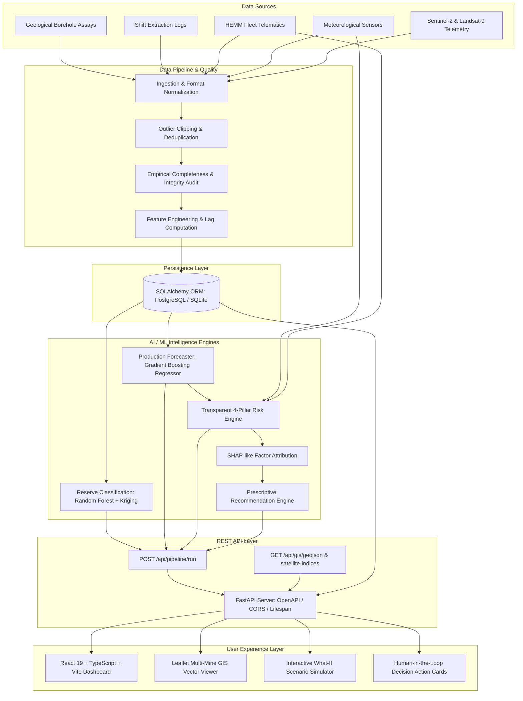
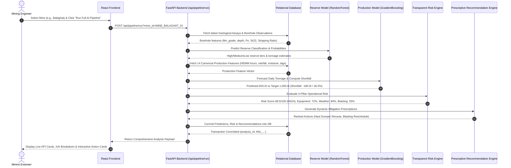

# System Architecture & Technical Specifications
**MOIL AI Mining Intelligence Platform | SIH 2026 Problem Statement PS-26009**
**Organization:** MOIL Limited / Ministry of Steel

---

## 1. High-Level Architecture Overview

The MOIL Mining Intelligence Platform couples surface remote sensing (Sentinel-2, Landsat-9) with subsurface borehole core drilling assays, historical shift extraction logs, and heavy machinery telematics. The platform is designed around the closed-loop paradigm:

$$\text{Discover (Reserve ML)} \longrightarrow \text{Predict (Production ML)} \longrightarrow \text{Detect (Risk Engine)} \longrightarrow \text{Prescribe (Prescriptive XAI)}$$



---

## 2. Six-Member Conceptual Ownership Architecture

To simulate a professional enterprise engineering environment, the codebase is partitioned into 6 distinct ownership tracks:

```text
┌─────────────────────────────────────────────────────────────────────────────┐
│ 1. TEAM LEAD / INTEGRATION                                                  │
│    • System Topology & Unified Pipeline: backend/app/api/routes/pipeline.py │
│    • Containerization & Orchestration: Dockerfile, docker-compose.yml       │
│    • Deployment Automation: render.yaml, .github/workflows/ci.yml           │
└─────────────────────────────────────────────────────────────────────────────┘
                                  │
         ┌────────────────────────┼────────────────────────┐
         ▼                        ▼                        ▼
┌──────────────────┐    ┌──────────────────┐    ┌──────────────────┐
│ 2. RESERVE ML    │    │ 3. PRODUCTION &  │    │ 4. GIS & SPACE   │
│    SPECIALIST    │    │    RISK ML       │    │    TECHNOLOGY    │
│ • Subsurface     │    │ • Production     │    │ • Multi-mine     │
│   assays         │    │   regression     │    │   GeoJSON layers │
│ • Lithology      │    │ • 14 lag-shifted │    │ • Leaflet map    │
│   encoding       │    │   features       │    │   vector styling │
│ • Random Forest  │    │ • 4-pillar risk  │    │ • Sentinel-2     │
│   classifier     │    │   scoring        │    │   NDVI, SAVI     │
│ • Spatial        │    │ • SHAP factor    │    │ • Landsat-9 LST  │
│   Kriging        │    │   attribution    │    │   & minerals     │
└──────────────────┘    └──────────────────┘    └──────────────────┘
         │                        │                        │
         └────────────────────────┼────────────────────────┘
                                  ▼
         ┌─────────────────────────────────────────────────┐
         │ 5. BACKEND, DB & DATA PIPELINE SPECIALIST       │
         │    • FastAPI REST Router & Endpoints            │
         │    • SQLAlchemy ORM (14 Relational Models)      │
         │    • SQLite & PostgreSQL Dual Driver Support    │
         │    • Data Cleaning, Validation & Quality Engine │
         └─────────────────────────────────────────────────┘
                                  │
                                  ▼
         ┌─────────────────────────────────────────────────┐
         │ 6. FRONTEND & UI/UX SPECIALIST                  │
         │    • React 19 + TypeScript + Vite Dashboard     │
         │    • Responsive Leaflet GIS Integration         │
         │    • What-If Operational Simulation Engine      │
         │    • Human-in-the-Loop Management Interface     │
         │    • SIH 2026 Crisis Demo Scenario Trigger      │
         └─────────────────────────────────────────────────┘
```

---

## 3. Database Entity-Relationship (ER) Architecture

The relational schema is defined in `database/models.py` across 14 normalized tables:

```text
+-------------------+       +-----------------------+       +------------------------+
|      mines        |1     *|      mine_zones       |1     *| geological_observations|
+-------------------+-------+-----------------------+-------+------------------------+
| id (PK)           |       | id (PK)               |       | id (PK)                |
| name              |       | mine_id (FK)          |       | zone_id (FK)           |
| state             |       | name                  |       | borehole_id            |
| district          |       | boundary_coordinates  |       | depth_m                |
| latitude          |       | current_rl_m          |       | manganese_pct          |
| longitude         |       | target_grade          |       | iron_pct               |
| mining_type       |       | planned_daily_tonnes  |       | silica_pct             |
| operational_status|       +-----------------------+       | lithology              |
+-------------------+                   |                   | reserve_category       |
        | 1                             | 1                 +------------------------+
        |                               |
        | *                             | *
+-------------------+       +-----------------------+       +------------------------+
|     equipment     |       | satellite_observations|       |  weather_observations  |
+-------------------+       +-----------------------+       +------------------------+
| id (PK)           |       | id (PK)               |       | id (PK)                |
| mine_id (FK)      |       | zone_id (FK)          |       | mine_id (FK)           |
| equipment_type    |       | acquisition_date      |       | observation_date       |
| model_name        |       | ndvi                  |       | rainfall_mm            |
| serial_number     |       | ndwi                  |       | temp_celsius           |
| year_commissioned |       | savi                  |       | humidity_pct           |
+-------------------+       | lst_kelvin            |       | soil_moisture_pct      |
        | 1                 | clay_ratio            |       | flood_alert_level      |
        |                   | iron_ratio            |       +------------------------+
        | *                 +-----------------------+
+-------------------+
|  equipment_status |
+-------------------+
| id (PK)           |
| equipment_id (FK) |
| shift_date        |
| shift_type        |
| operating_hours   |
| breakdown_hours   |
| failure_mode      |
+-------------------+
```

### Operational & Decision Support Tables:
- `production_records`: Records daily shift target vs actual mined ore tonnage, grade, stripping ratio, and haulage cycle count.
- `reserve_predictions`: Stores ML reserve classification outputs (High/Medium/Low, probability, estimated tonnage).
- `production_predictions`: Stores Gradient Boosting regressor outputs, target planned tonnages, shortfall values, and deficit percentages.
- `risk_assessments`: Captures composite risk score (0–100), risk tier, equipment risk, weather risk, blasting risk, and contributing factor weights.
- `recommendations`: Tracks actionable interventions (`title`, `category`, `problem_summary`, `recommended_action`, `expected_tonnage_recovery`, `urgency`, `status`).
- `model_versions`: Registry tracking active algorithms, training dates, validation metrics, and version tags.

---

## 4. End-to-End Execution Flow (`/api/pipeline/run`)

When an operator triggers **"Run Full AI Mining Analysis"** in the UI:



---

## 5. GIS & Space Technology Architecture

The spatial subsystem bridges satellite remote sensing with open-pit mining operations:

### Multi-Mine Coordinate System
Each of the 8 MOIL concessions is spatially anchored:
- **Balaghat (`MINE_BALAGHAT_01`):** `[21.8502, 80.2274]`
- **Gumgaon (`MINE_GUMGAON_02`):** `[21.3833, 79.0333]`
- **Tirodi (`MINE_TIRODI_03`):** `[21.6833, 79.7167]`
- **Chikla (`MINE_CHIKLA_04`):** `[21.5500, 79.7667]`
- **Dongri Buzurg (`MINE_DONGRI_05`):** `[21.5333, 79.6833]`
- **Ukwa (`MINE_UKWA_06`):** `[21.9667, 80.4667]`
- **Kandri (`MINE_KANDRI_07`):** `[21.4167, 79.2667]`
- **Mansar (`MINE_MANSAR_08`):** `[21.4000, 79.2833]`

### Layer Hierarchy
1. **Concession Lease Boundary (`FeatureCollection`):** Outer perimeter defining legal lease lines.
2. **Operational Pit Benches:** Contour lines representing pit terraces with relative levels (RL).
3. **Reserve Block Heatmap:** GeoJSON polygons color-coded by estimated reserve probability and manganese grade.
4. **Environmental / Inundation Overlays:** Surface moisture and flood-prone drainage channels derived from satellite NDWI and terrain elevation models.
